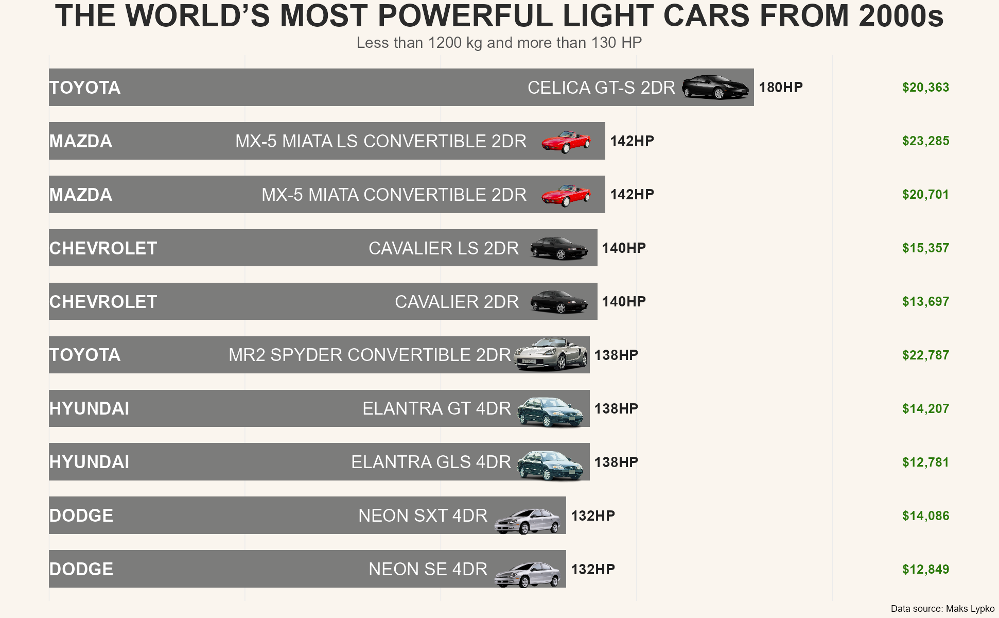
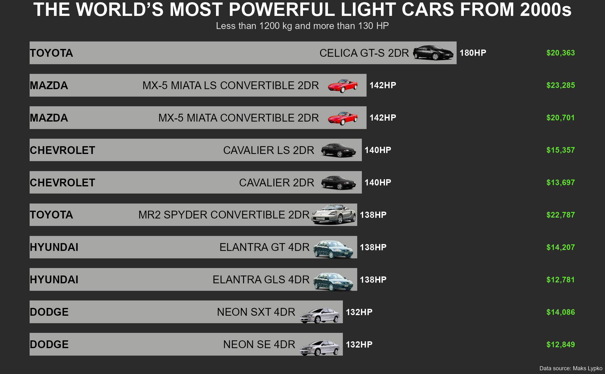

# 🚗 Light Cars Analysis  

**Created:** 2025  
**Last updated:** 04/11/2025

## 🎯 Goal  
Identify which lightweight car models (under 2646 lb ≈ 1200 kg) deliver the highest power to understand **which brands dominate the lightweight sports car market**.  
This can help **automotive companies or dealerships** identify potential market opportunities and customer preferences in the performance segment.

---

## ⚙️ Process  

1. **Data Cleaning & Preparation** (`Large Cars Dataset.csv`)  
   - Filtered cars weighing less than **2646 lb (~1200 kg)**.  
   - Standardized column names with `clean_names()`.  
   - Trimmed extra spaces from model names.  
   - Sorted by descending `horse_power`.  

2. **Data Enrichment**  
   - Added car image URLs for visual reference.  
   - Created two visual themes: **light** and **dark**.  

3. **Visualization**  
   - Highlighted only cars with **more than 130 HP**.  
   - Displayed car models, brands, power, and dealer cost.  
   - Included car images aligned with each bar for visual clarity.  

---

## 🧰 Tools & Libraries  
- **R**  
- **tidyverse** → data manipulation & visualization  
- **janitor** → data cleaning (`clean_names`)  
- **ggimage** → embedding car images in plots  
- **scales** → formatting numeric labels  

**Dataset:** [Large Cars Dataset – Maks Lypko (Kaggle)](https://www.kaggle.com/datasets/makslypko/large-cars-dataset)  
*This dataset is publicly available on Kaggle under the terms specified by the dataset author.*  

---

## 📊 Results  

The analysis highlights which **lightweight car models** stand out in terms of **horsepower**, allowing a clear comparison between brands and engineering approaches within the sub-2646 lb ≈ 1200 kg range, showing how performance and design vary across the 2000s light car segment.

### Insights
- Most lightweight high-power cars are **Japanese**, mainly **Toyota** and **Mazda**.  
- This suggests that the **Japanese sports car market dominates** the lightweight performance segment.  
- Companies aiming to target customers interested in high-performance yet lightweight vehicles should **focus on Japanese brands and their design philosophy**.

Two dashboard versions were created:  

- 🌞 **Light Theme** → clean, presentation-oriented  
- 🌚 **Dark Theme** → for modern or portfolio visuals  
> 💡 *Note: Dealer cost values correspond to prices from the 2000s dataset and are not adjusted for inflation or current market values.*

---

## 🚀 Next Steps  

- Add a **power-to-weight ratio** analysis to compare efficiency beyond raw horsepower.  
- Incorporate **engine type (e.g., V4, V6, etc.)** to explore relationships between structure and performance.  
- Create an **interactive dashboard (Shiny or Power BI)** to allow filtering by brand, horsepower, or cost.  
- Adjust dealer cost to **2025 equivalent values** for modern insights.  

---

## 🖼️ Preview  

---

**Author:** [Pablo – Data Analyst](https://github.com/PabloDataAnalyst) 
© 2025 Pablo. Shared publicly for portfolio purposes.