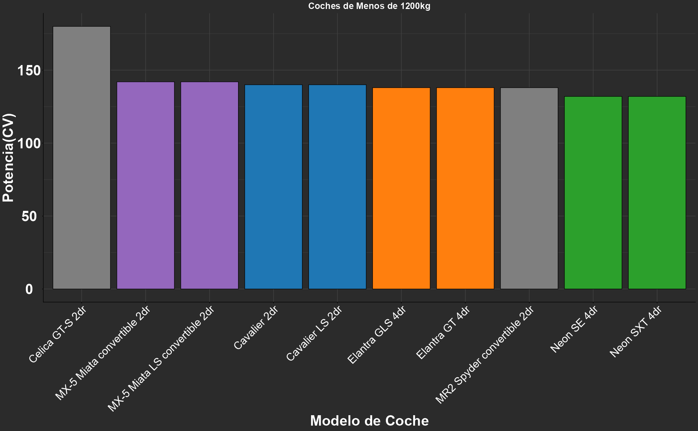

# Light Cars Analysis 🚗

## Goal:
Explore how the power of light cars (under 2646 lb / ~1200 kg) varies by model and brand, highlighting the most powerful ones.

## Process:
1. Data cleaning and manipulation (`Large Cars Dataset.csv`):
   - Filtered light cars (weight < 2646 lb ≈ 1200 kg).
   - Sorted by `horse_power`.
   - Renamed columns using `clean_names()`.
2. Selected cars with power > 130 HP.
3. Created a bar chart showing the most powerful models and their brands.

## Tools:
R, tidyverse, janitor  

**Dataset:** Large Cars Dataset  ([Kaggle Link](https://www.kaggle.com/datasets/makslypko/large-cars-dataset))
*This dataset is publicly available on Kaggle under the terms specified by the dataset author.*
**Focus:** Data cleaning, filtering, and visualization  

## Results:
The analysis shows which light car models stand out in terms of power, helping to compare brands and designs within the analyzed weight range.

